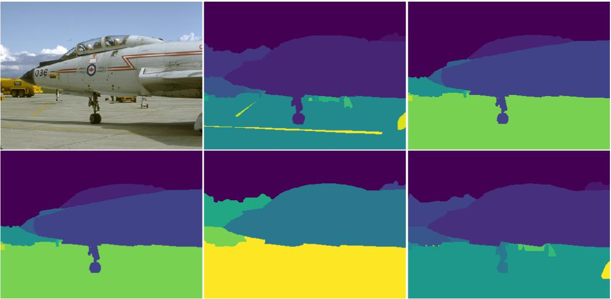
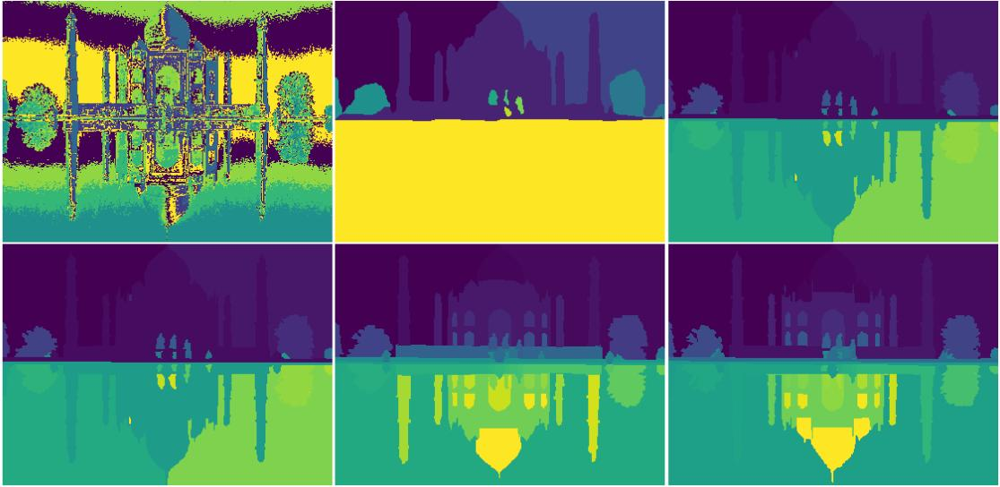
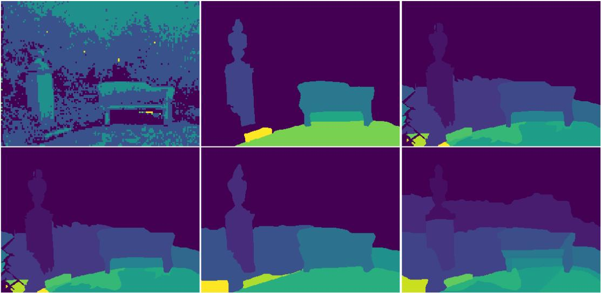
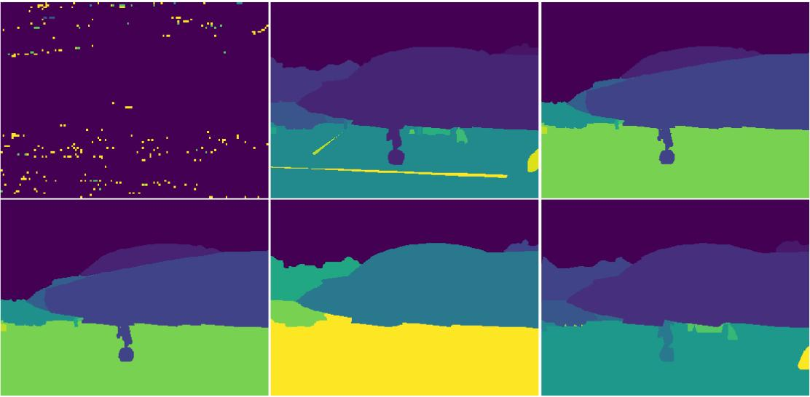
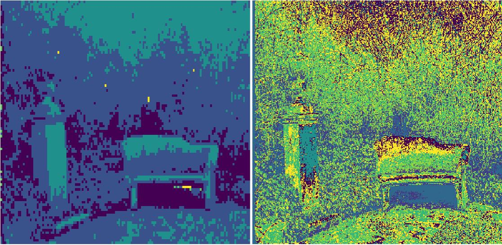
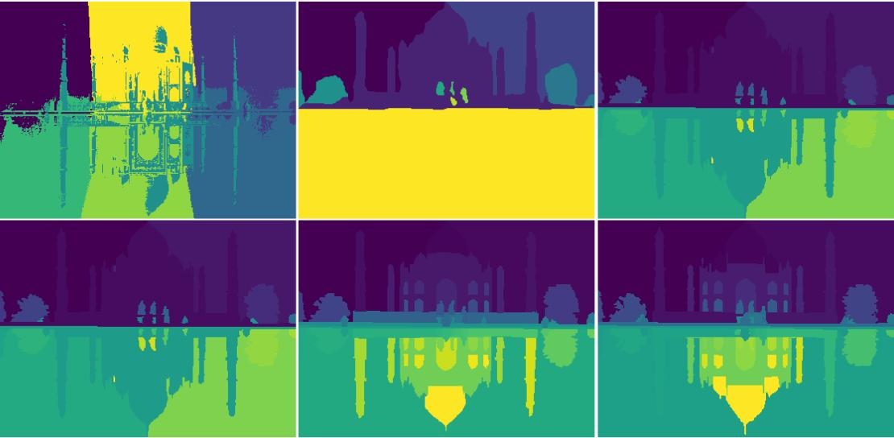

Introduction
============

Image segmentation means that we can group similar pixels together and give these grouped pixels the same label. The grouping problem is a clustering problem. We used K-means and spectral clustering on the Berkeley Segmentation Benchmark. We will talk about each technique and the results of the evaluation using F-measures and Conditional Entropy.

Dataset Preprocessing
=====================

The dataset contains two folders of images, the original images and the ground truth images which are saved in matlab file format. Each image has 5 ground truth segmentation that will be used later for evaluations. We worked on 50 images of the dataset and they are all landscape images to work on images with the same sizes. Below is a subplots of an original image and its ground truth segmentation.

 [fig:subplots]

K-means Clustering
==================

In the K-means algorithm we cluster each image upon its pixels’ values. Each pixel has three values as we are dealing with images with 3-dimensions (R,G,B). We use this technique with 5 values for k : [3,5,7,9,11]. The result of the k-means is an array of the assignments for each pixel, so a pixel will have a value from the unique clusters numbers. After taking this assignments array we plotted the array as a coloured image with unique colour for each cluster. Below is a clustered image after k-means algorithm is applied.

 [fig:k-means]

Evaluation Measures
===================

We evaluated the result segmentation using F-measure, Conditional Entropy for image I with M available ground-truth segmentation. For a clustering of K-clusters we reported our measures M times and the average of the M trials as well. And also we reported the average of the whole dataset.

F-measures
----------

F-measure is an external validity indexes that combines the precision and recall concepts from information retrieval. Its values are within [0,1] and larger values indicate higher clustering quality. It is done after evaluating K-mean segmentation on the 50 image. We look for the unique clusters generated and take positions of pixels for each cluster then using these positions to get same pixels from ground truth to evaluate precision and recall on them. This is done for every image K times for different k-mean evaluation each with every M of ground truth images. Results are shown in table below.

Conditional Entropy
-------------------

Conditional entropy is an external measure that relies on the entropy of partition T with respect to cluster Ci. The objective is to make the evaluation using this technique by getting the resulted clusters of our k-means and then get the positions of each pixel to get the value of it from the ground truth image. We then make our calculations upon these information and evaluate the clustering upon the resulted value. Below is a table containing some values for the conditional entropy.

Measures Comparison
-------------------

There are 250 average result for each image with a value for k, but here in the report we reported only the min, max and the average of the whole dataset. The 250 results are in the jupyter file printed.

 |p5cm||p5cm|p5cm| 
averages & F-measure & Conditional Entropy
minimum avg value & 0.930017 & 0.00886
maximum avg value & 3.800569 & 0.30849
average of whole dataset & 1.858292 & 0.09197

a Big Comparison
================

In this section we will compare between ground truth images and the result of k-means and the spectral clustering techniques.

K-means vs Ground Truth
-----------------------

Below is a comparison on one image instead of the five. And it’s obvious that the clustering of k-means is not good in our way as we cluster on the value of the pixel only, but we could improve our results by also adding channels with the pixel position to get great results and great image segmentation.

 [fig:subplots]

Spectral Clustering vs Ground Truth
-----------------------------------

To perform spectral clustering we used the sklearn method SpectralClustering to directly build the 5-NN affinity matrix and perform the k-means step following the transformation into the spectral embedding space, however we re-sized the images to 25% of their original size since this seemed more practical given the resources we had at hand. This method seemed to perform very well on some of the samples and was horrible on others, one from each group is in the figure below, this might be due to the affinity matrix used which doesn’t seem to capture the color changes within the image.

 [fig:spec1]

 [fig:spec2]

Spectral Clustering vs K-means
------------------------------

 [fig:spec2]

Extra Work
==========

 [fig:addedf]

Conclusion
==========

Without adding spatial features K-means only clustered the colors of the image into less colors which wasn’t suitable for the segmentation task, however with spectral clustering since the 5-NN graph took into consideration the relative positioning of pixels images seemed to be segmented more nicely. When we added the spatial features to the K-means, the segmentation improved, however the image was split linearly without considering the object boundries.
